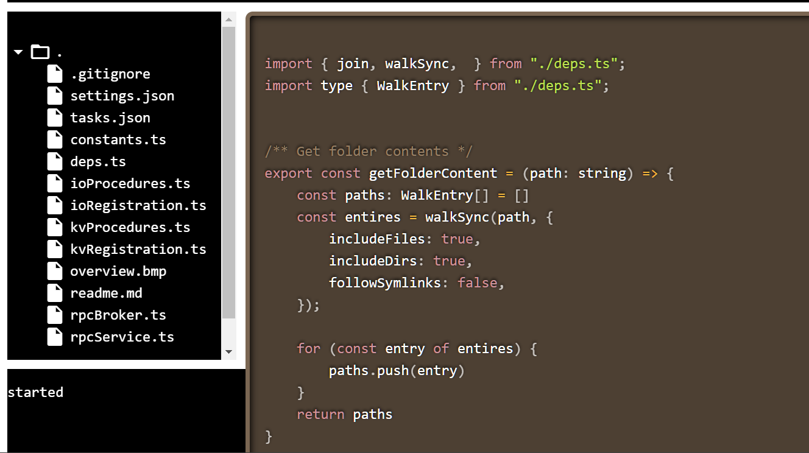

# File-Tree RPC

This application demonstrates RPC calls to an BuenoRPC broker service.    

The app initially makes a call to get all items from the root folder.    
The data returned is then loaded in a treeview UI.    
Selecting an item in the treeview will request its content from the broker.    
Any text content will then be presented in a code presentation control.    
    
    

## Try it: https://nhrones.github.io/File-Tree/    

All of this is accomplished by means of Remote Procedure Calls - RPC.     

## Please see: https://github.com/nhrones/BuenoRPC
